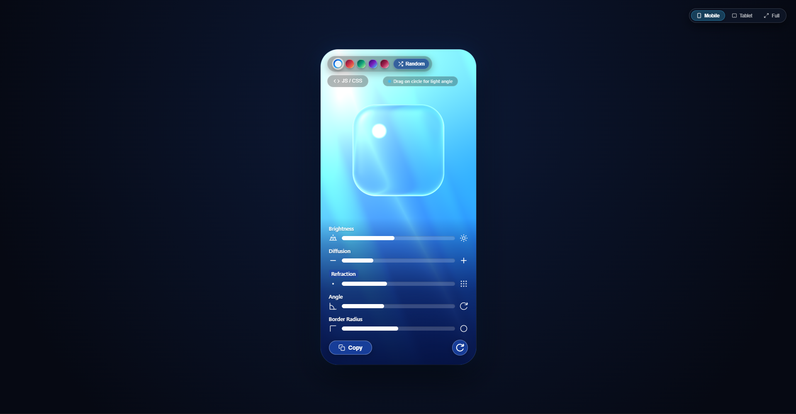

# Liquid Glass 🔮


<p align="center">
  
</p>

<p align="center">
  <a href="https://pphatdev.github.io/liquid-glass/"></a>
  <a href="https://opensource.org/licenses/MIT"></a>
  
  
</p>

Ultra-realistic, physical **3D optical liquid glass lenses** with Snell's Law ray refraction, chromatic dispersion (spectral RGB wavelength split), dynamic specular highlights, and animated silk wave shaders.

Available as a **zero-dependency WebGL library**, a drop-in **HTML Web Component**, an **SVG optical refraction filter**, and **pure CSS glassmorphism**.

---

## ✨ Features

* 🔮 **Physical Snell's Law Refraction** — Real-time ray-traced optical bending through 3D spherical SDF glass lenses.
* 🌈 **Chromatic Dispersion** — Spectral RGB wavelength splitting along the glass bevel and rim.
* ✨ **Dynamic Specular Glare Arc** — Dual-layer high-gloss glare spot tracking incident light angle.
* 🌊 **Procedural Silk Cloth Shader** — Smooth, animated flowing cloth background rendered natively in GPU GLSL.
* 🎨 **Curated Harmonic Palettes** — Azure Silk, Sunset Gold, Emerald Aurora, Cyber Violet, Obsidian Rose, and procedural color generation.
* 📱 **Ergonomic Widget Card** — Responsive card container with mobile, tablet, and fullscreen views.
* ⚡ **Zero Dependencies** — Single lightweight ESM bundle under 18 KB with 60 FPS GPU acceleration.
* 🧩 **Web Component Ready** — Drop into any website with `<liquid-glass palette="azure"></liquid-glass>`.

---

## 🚀 Quick Start

### 1. Ready-to-Run HTML Card (Exact Demo Appearance)

Save as `index.html` and open in any browser:

```html
<!DOCTYPE html>
<html lang="en">
<head>
  <meta charset="UTF-8">
  <meta name="viewport" content="width=device-width, initial-scale=1.0">
  <title>Liquid Glass - Demo Card</title>
  <style>
    body {
      margin: 0;
      min-height: 100vh;
      background: #080c16;
      display: flex;
      align-items: center;
      justify-content: center;
      font-family: -apple-system, BlinkMacSystemFont, "Segoe UI", Roboto, sans-serif;
      padding: 24px;
    }
    .liquid-glass-card {
      width: 390px;
      height: 720px;
      max-width: 100%;
      border-radius: 40px;
      overflow: hidden;
      position: relative;
      background: #000;
      box-shadow:
        0 30px 80px rgba(0, 0, 0, 0.75),
        0 0 0 1px rgba(255, 255, 255, 0.18),
        inset 0 1px 1px rgba(255, 255, 255, 0.35);
    }
    #liquid-glass-canvas {
      width: 100%;
      height: 100%;
      display: block;
      cursor: grab;
    }
    #liquid-glass-canvas:active {
      cursor: grabbing;
    }
  </style>
</head>
<body>

  <div class="liquid-glass-card">
    <canvas id="liquid-glass-canvas"></canvas>
  </div>

  <script type="module">
    import { LiquidGlass } from './liquid-glass.js';

    const canvas = document.getElementById('liquid-glass-canvas');
    const glass = new LiquidGlass(canvas, {
      palette: 'azure',    // 'azure' | 'sunset' | 'emerald' | 'violet' | 'rose'
      brightness: 1.00,
      diffusion: 0.28,
      refraction: 0.10,
      angle: 135,
      borderRadius: 50,
      interactive: true
    });

    glass.start();
  </script>
</body>
</html>
```

---

### 2. HTML Custom Web Component

Include `liquid-glass.js` and use the custom `<liquid-glass>` element directly in your HTML:

```html
<script type="module" src="./liquid-glass.js"></script>

<!-- Embedded Web Component -->
<liquid-glass
  palette="azure"
  refraction="0.12"
  style="display: block; width: 390px; height: 700px; border-radius: 36px; overflow: hidden; box-shadow: 0 30px 80px rgba(0,0,0,0.6);">
</liquid-glass>
```

---

### 3. JavaScript / ESM Import

```javascript
import { LiquidGlass } from './liquid-glass.js';

const canvas = document.getElementById('liquid-glass-canvas');
const glass = new LiquidGlass(canvas, {
  palette: 'sunset',
  refraction: 0.15,
  diffusion: 0.30,
  angle: 180,
  interactive: true
});

glass.start();
```

---

## 🛠️ API Reference

### `new LiquidGlass(target, options)`

* **`target`**: Canvas element (`HTMLCanvasElement`) or CSS selector string (`'#my-canvas'`).
* **`options`**:

| Option | Type | Default | Description |
| :--- | :--- | :--- | :--- |
| `palette` | `string` | `'azure'` | Color scheme: `'azure'`, `'sunset'`, `'emerald'`, `'violet'`, `'rose'` |
| `brightness` | `number` | `1.00` | Optical brightness multiplier (`0.50` – `2.00`) |
| `diffusion` | `number` | `0.28` | Frosted glass roughness blur (`0.00` – `1.00`) |
| `refraction` | `number` | `0.10` | Snell's Law ray bending strength (`0.00` – `0.35`) |
| `angle` | `number` | `135.0` | Incident light / specular glare angle in degrees (`0` – `360`) |
| `borderRadius` | `number` | `50` | Geometry shape: `0` (square panel) to `100` (circular sphere) |
| `ior` | `number` | `1.48` | Index of refraction (flint/crown glass physics) |
| `dispersion` | `number` | `0.022` | Chromatic dispersion wavelength split factor |
| `orbX` | `number` | `0.50` | Center horizontal position in UV space (`0.0` – `1.0`) |
| `orbY` | `number` | `0.68` | Center vertical position in UV space (`0.0` – `1.0`) |
| `interactive` | `boolean` | `true` | Enables pointer dragging to move the lens & rotate light angle |

### Methods

* **`glass.start()`**: Starts the 60 FPS animation render loop.
* **`glass.stop()`**: Pauses the render loop.
* **`glass.setOptions(options)`**: Dynamically updates configuration parameters at runtime without reloading.
* **`glass.setPalette(paletteId)`**: Smoothly transitions colors to a new theme.
* **`glass.resize()`**: Recalculates canvas dimensions and viewport taking `devicePixelRatio` into account.
* **`glass.destroy()`**: Cancels animation frame and disconnects resize observers.

---

## 🌊 HTML + SVG Optical Refraction (No WebGL)

If you need optical distortion over DOM elements without a WebGL canvas:

```html
<div class="glass-container">
  <div class="liquid-glass-lens">
    <h3>Refracted DOM Content</h3>
  </div>
</div>

<svg style="position: absolute; width: 0; height: 0; pointer-events: none;">
  <filter id="liquid-refract">
    <feTurbulence type="fractalNoise" baseFrequency="0.016" numOctaves="2" result="noise" />
    <feDisplacementMap in="SourceGraphic" in2="noise" scale="28" xChannelSelector="R" yChannelSelector="G" />
  </filter>
</svg>

<style>
  .glass-container {
    display: flex;
    align-items: center;
    justify-content: center;
    min-height: 100vh;
    background: linear-gradient(135deg, #0438b8, #1898f8, #f8c880);
  }

  .liquid-glass-lens {
    width: 280px;
    height: 280px;
    border-radius: 50%;
    /* Bends background light using SVG displacement */
    backdrop-filter: url(#liquid-refract) blur(16px) brightness(1.00);
    -webkit-backdrop-filter: url(#liquid-refract) blur(16px) brightness(1.00);

    /* Dual-layer specular highlight */
    background:
      radial-gradient(circle 44px at 32% 32%, rgba(255, 255, 255, 0.98) 0%, rgba(255, 255, 255, 0.65) 28%, transparent 100%),
      radial-gradient(circle at 32% 32%, rgba(255, 255, 255, 0.35) 0%, rgba(255, 255, 255, 0.10) 45%, transparent 80%),
      rgba(255, 255, 255, 0.08);

    border: 1px solid rgba(255, 255, 255, 0.50);
    box-shadow:
      0 24px 60px rgba(0, 0, 0, 0.35),
      inset 0 2px 4px rgba(255, 255, 255, 0.85),
      inset 0 -2px 4px rgba(0, 0, 0, 0.25);
  }
</style>
```

---

## 🎨 Pure CSS Glassmorphism Recipe

For high-performance pure CSS glass cards:

```css
.liquid-glass-lens {
  width: 280px;
  height: 280px;
  border-radius: 50%;

  /* Optical frosted blur */
  backdrop-filter: blur(16px) brightness(1.00);
  -webkit-backdrop-filter: blur(16px) brightness(1.00);

  /* Dual-layer specular glare (light angle 135° = 32% 32%) */
  background:
    radial-gradient(circle 44px at 32% 32%, rgba(255, 255, 255, 0.98) 0%, rgba(255, 255, 255, 0.65) 28%, transparent 100%),
    radial-gradient(circle at 32% 32%, rgba(255, 255, 255, 0.35) 0%, rgba(255, 255, 255, 0.10) 45%, transparent 80%),
    rgba(255, 255, 255, 0.08);

  /* Crystalline rim bevel and internal reflection */
  border: 1px solid rgba(255, 255, 255, 0.50);
  box-shadow:
    0 24px 60px rgba(0, 0, 0, 0.35),
    inset 0 0 10px rgba(255, 255, 255, 0.50),
    inset 2px 0 4px rgba(255, 60, 120, 0.25),
    inset -2px 0 4px rgba(60, 160, 255, 0.25),
    inset 0 2px 4px rgba(255, 255, 255, 0.85),
    inset 0 -2px 4px rgba(0, 0, 0, 0.25);
}
```

---

## 📁 Repository Structure

```
├── liquid-glass.js        # Standalone reusable WebGL library & Web Component
├── demo.js                # Interactive reference controller & code exporter
├── demo.css               # Modern iOS-inspired styling & glassmorphism theme
├── index.html             # Interactive showcase application
├── .nojekyll              # GitHub Pages Jekyll bypass
├── .github/
│   └── workflows/
│       └── deploy.yml     # Automated GitHub Pages static deployment
└── .agents/
    └── skills/
        └── liquid-glass/  # Agent skill for automatic discovery & code generation
```

---

## 💻 Local Development

Run with any local web server:

```bash
# Using Python
python -m http.server 8000

# Using Node.js npx
npx serve .
```

Open `http://localhost:8000` in your browser.

---

## 🚢 GitHub Pages Deployment

The repository is pre-configured with automated GitHub Actions deployment to [`pphatdev.github.io/liquid-glass`](https://pphatdev.github.io/liquid-glass/).

To deploy:
1. Commit and push your changes to `master` (or `main`).
2. GitHub Actions will automatically validate, bundle, and deploy to GitHub Pages.

---

## 📄 License

[MIT License](LICENSE) © 2026 [Sophat Pho](https://github.com/pphatdev)
